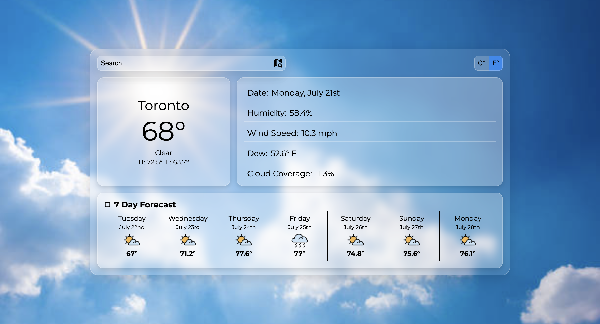
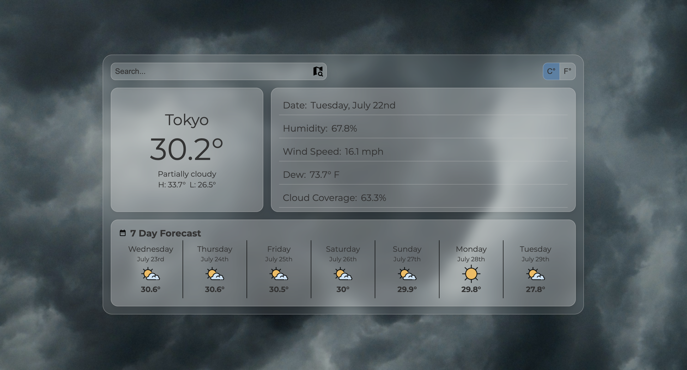
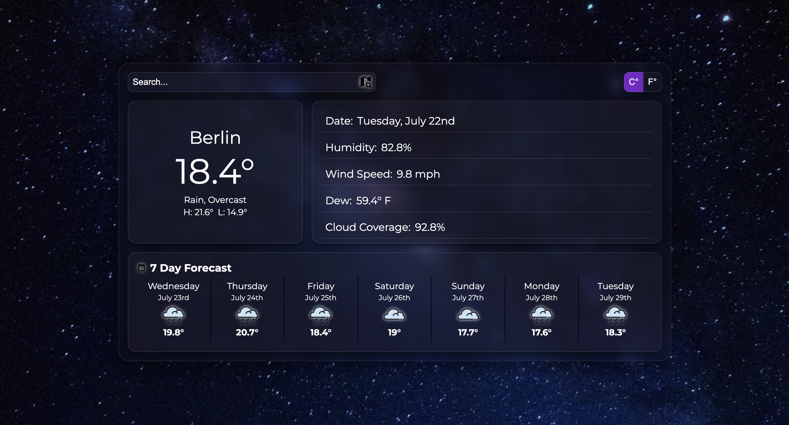

# Weather App

A Modern take of a Weather app with beautiful UI.

This project I focused on learning about API's and how to use them within my projects. The Api used in my project is the Visual Crossing Web Api. Through this projects I learnt how fetch, asynchronous code and aync and await work. I've learnt that using Api's comes with addtional hardships as even though we can use their data the load times of the site get slower and it takes more work to optimize.

## Features

- Search for any City in the World!
- Switch between Celsius and Fahrenheit!
- See Today's Weather Details!
- See Additional information on Todays Weather on the right!
- See the Next Week's weather information.
- Clean and Modern UI

[Live Demo](https://raihancarder.github.io/weather-app/)

## Screenshots

## Prerequisites

- [Node.js](https://nodejs.org/) (v14 or higher recommended)
- npm (comes with Node)

## API

This project uses the [Visual Crossing Weather API](https://www.visualcrossing.com/weather-api) to fetch weather data.

## Installation

1. Clone the repo  
   `git clone https://github.com/raihanCarder/weather-app.git`

2. Navigate to the folder  
   `cd weather-app`

3. Install Dependencies with `npm install` in terminal.

4. Build Project with `npm run build` in terminal.

5. Open dist/index.html in browser or preview with VS Live Server.

## Tech Stack

- Javascript
- HTML
- CSS
- Webpack

Created by Raihan Carder(https://github.com/raihanCarder)  
Feel free to reach out!
